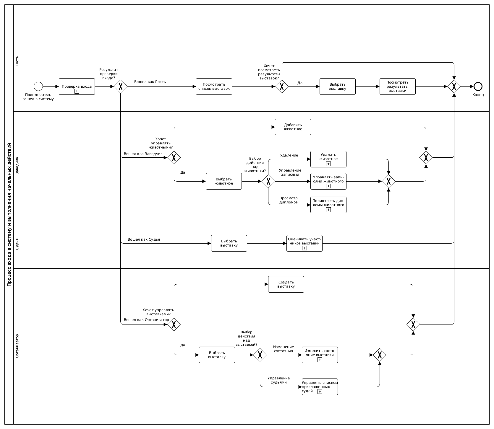
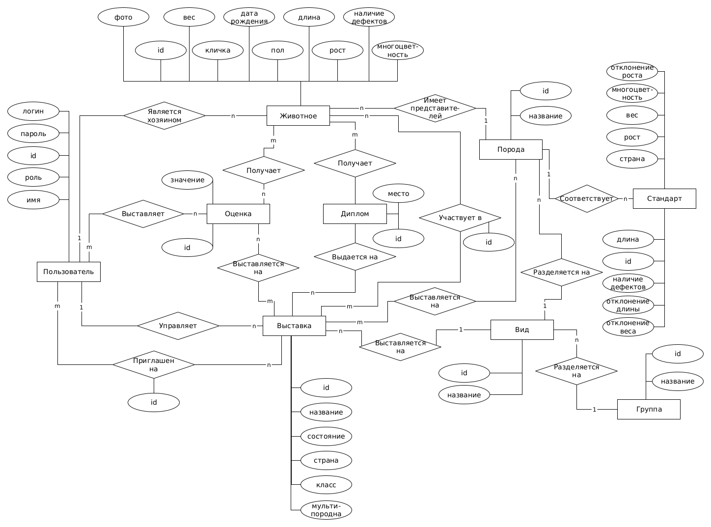

# PETOWO

### a. Цель работы, решаемая проблема/предоставляемая возможность

Цель работы --- разработка Web-приложения для организации выставок животных различных видов.

В 21 веке наблюдается рост числа домашних животных, а также клубов --- объединений людей, которые занимаются разведением питомцев; то есть увеличивается количество заводчиков, нуждающихся в организации выставок.

Данное приложение предоставляет возможность проведения онлайн--выставок различных видов животных с автоматизацией процесса организации мероприятий (запись, сбор оценок, вычисление результатов).

### b. Краткий перечень функциональных требований

К разрабатываемой системе выдвигаются перечисленные далее функциональные требования.

Проведение выставки включает в себя следующие необходимые действия пользователей:

1. авторизация;
0. создание выставки (организатором);
0. запуск, завершение выставки (организатором);
0. добавление судьи на выставку (организатором);
0. добавление животного (заводчиком);
0. запись животного на выставку (заводчиком);
0. оценка участников выставки (судьей);
0. просмотр результатов завершенной выставки.

Возможными действиями заводчика являются следующие:

1. удаление животного;
0. отписка животного от выставки;
0. просмотр дипломов животного.

Возможным действием организатора является удаление судьи с выставки.
Возможным действием гостя и всех остальных пользователей является просмотр списка выставок.

При разработке системы необходимо учитывать следующие правила организации выставок животных:

1. результаты выставки доступны для просмотра пользователям только после ее завершения;
0. удалить животное нельзя, если оно является участником хотя бы одной запущенной выставки;
0. записать животное на неоткрытую выставку нельзя;
0. записать животное можно на выставку только его вида (породы);
0. записать животное на выставку можно только в случае допустимых отклонений от стандарта;
0. отписать животное от выставки можно только если оно на нее записано и при условии, что она открыта;
0. запустить выставку можно, если есть хотя бы один приглашенный судья и не менее одного участников;
0. выставка завершается только при условии, что каждый судья поставил оценку каждому участнику выставки;
0. удалить судью с выставки можно только в том случае, если выставка открыта;
0. добавить судью на выставку можно, если выставка открыта и он не был добавлен ранее.

### c. Use-Case - диаграмма

На рисунке ниже представлена Use-Case диаграмма.

### d. Формализация ключевых бизнес-процессов

На рисунке ниже представлена диаграмма процесса входа в систему и выполнения начальных действий.

### e. Пользовательские сценарии

1. ПРОСМОТР ВЫСТАВОК
	1. Пользователь входит как Гость/Заводчик/Судья/Организатор
	2. Гость/Заводчик/Судья/Организатор смотрит список выставок
2. ДОБАВЛЕНИЕ ЖИВОТНОГО
	1. Пользователь входит как Заводчик
	2. Заводчик добавляет животное
3. СОЗДАНИЕ ВЫСТАВКИ
	1. Пользователь входит как Организатор
	2. Организатор создает выставку

#### Сложные сценарии

4. УДАЛЕНИЕ СУДЬИ
	1. Пользователь входит как Организатор
	2. Организатор выбирает выставку
	3. Организатор хочет удалить судья
	4. Прервать действие, если выставка в состоянии "Запущена" или "Завершена"
	5. Прервать действие, если на выставке нет приглашенных судьей
	6. Организатор выбрал судью
	7. Удалить судью с выставки
5. ПРИГЛАШЕНИЕ СУДЬИ
	1. Пользователь входит как Организатор
	2. Организатор выбирает выставку
	3. Организатор хочет добавить судью на выставку
	4. Прервать действие, если выставка в состоянии "Запущена" или "Завершена"
	5. Прервать действие, если судья приглашен на выбранную выставку
	6. Добавить судью на выставку (пометить его как приглашенного)
6. РЕДАКТИРОВАНИЕ ВЫСТАВКИ
	1. Пользователь входит в систему как Организатор
	2. Организатор выбирает выставку
	3. Организатор хочет редактировать информацию о выставке
	4. Прервать действие, если выставка в состоянии "Запущена" или "Завершена"
	5. Редактировать информацию о выставке
6. ЗАПУСК ВЫСТАВКИ
	1. Пользователь входит в систему как Организатор
	2. Пользователь выбирает выставку
	3. Организатор хочет запустить выставку
	4. Прервать действие, если выставка в состоянии "Завершена"
	5. Прервать действие, если на выставку записано менее 3 участников
	6. Прервать действие, если нет приглашенных судей
	7. Отметить выставку запущенной
7. ЗАВЕРШЕНИЕ ВЫСТАВКИ
	1. Пользователь входит в систему как Организатор
	2. Организатор выбирает выставку
	3. Организатор хочет завершить выставку
	4. Прервать действие, если выставка не в состоянии "Запущена"
	5. Прервать действие, если есть хотя бы один судья, не оценивший всех участников
	6. Перевести выставку в состояние "Завершена"
	7. Вычислить результаты выставки
8. УДАЛЕНИЕ ЖИВОТНОГО
	1. Пользователь входит в систему как Заводчик
	2. Заводчик хочет удалить животное
	3. Прервать действие, если заводчик не имеет животных
	4. Заводчик выбирает животное
	5. Прервать действие, если животное является участником хотя бы одной выставки в состоянии "Запущена"
	6. Отметить данные о результатах выставок в состоянии "Завершена", в которых участвовало животное, как архивные
	7. Удалить животное из системы
9. ЗАПИСЬ ЖИВОТНОГО НА ВЫСТАВКУ
	1. Пользователь входит в в систему как Заводчик
	2. Заводчик хочет записать животных на выставку
	3. Прервать действие, если заводчик не имеет животных
	4. Прервать действие, если заводчик не имеет животных, подходящих по виду и/или породе
	5. Заводчик выбирает животное
	6. Прервать действие, если выбранное животное уже записано на выставку
	7. Прервать действие, если выбранное животное не соответствует стандарту выставки
	8. Записать животное на выставку
10. ПРОСМОТР РЕЗУЛЬТАТОВ ВЫСТАВКИ
	1. Пользователь входит как Гость/Заводчик/Судья/Организатор
	2. Пользователь выбирает выставку
	3. Пользователь хочет посмотреть результаты выставки
	4. Прервать действие, если выставка не в состоянии "Завершена"
	5. Сформировать отчет о результатах выставки
	6. Предоставить отчет пользователю

### f. ER-диаграмма сущностей

На рисунке ниже представлена ER-диаграмма сущностей.

### g. Диаграмма классов сущностей БД

### h. Верхнеуровневое разбиение на компоненты

### i. Экраны Web-приложения (эскизы)

Черновые наброски экранов

<!-- На рисунках ниже представлены экраны разрабатываемого Web-приложения. -->
<!---->
<!--  -->
<!---->
<!--  -->
<!---->
<!--  -->
<!---->
<!--  -->
<!---->
<!--  -->
<!---->
<!--  -->
